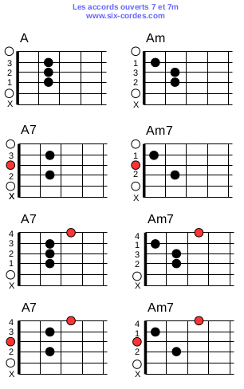

# Les notes sur le manche

# Les accords ouverts

# Pentatonique mineure

# Blues 12 bar blues 

||||
| :--: | :--: | :--: |

| **A7** | **A7** | **A7** | **A7** |
| :--: | :--: | :--: | :--: |
| **A7** | **D7** | **A7** | **A7** |
| **E7** | **D7** | **A7** | **E7** |

[Ecoute ça](media/blues-12-bar-blues.mp3)

# Boîte à rythmes
[Rock 120](media/drump_120.mp3)
