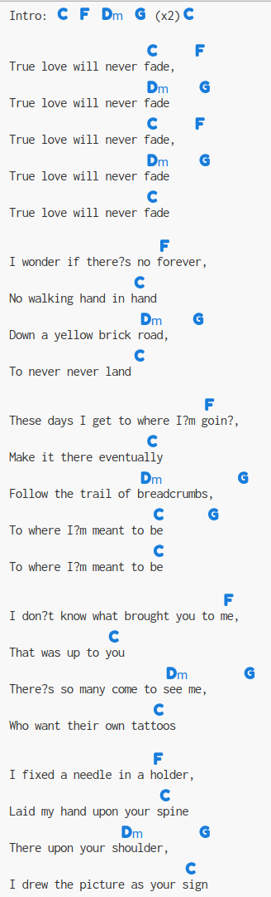
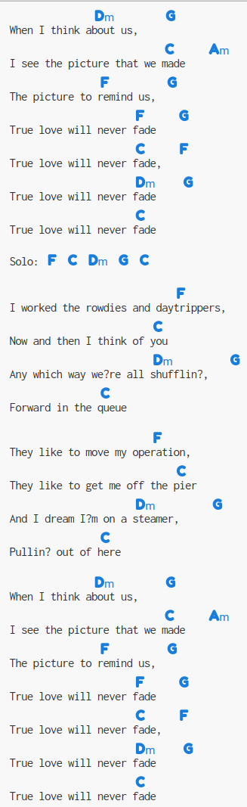
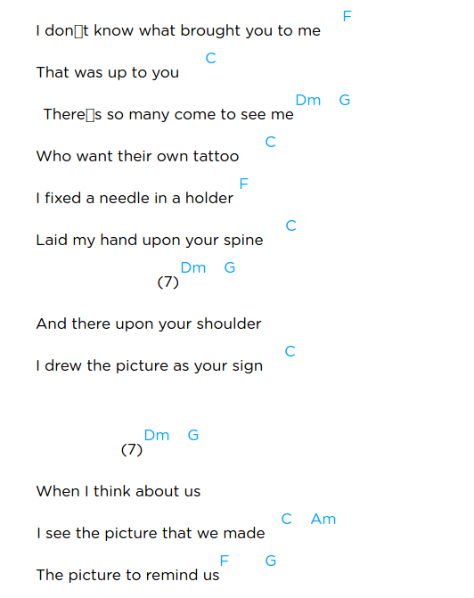
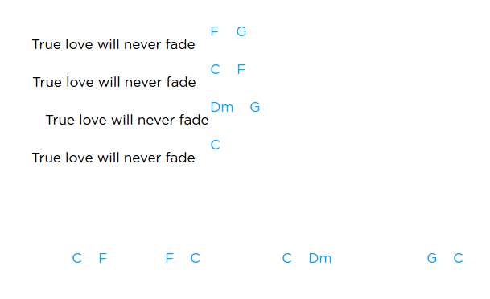
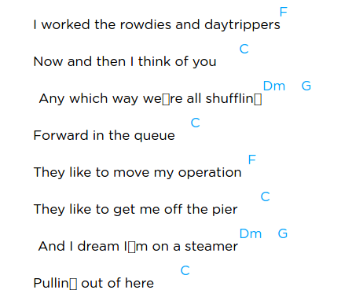
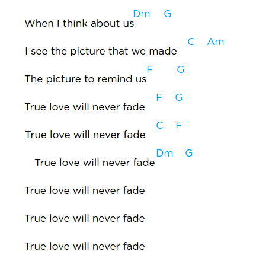

# "True Love Never Fade" de Mark Knopfler

[Ecoute ça](media/Mark Knopfler - True Love Will Never Fade.mp3)

## Tabbed By Mad Mart

Intro. `| C F Dm G | C F Dm G |`

Ref. `| C F Dm G | C F Dm G |`

 True love will never fade  
 True love will never fade  
 True love will never fade  
 True love will never fade  
 True love will never fade  

Vers. `| F C Dm G C | F C Dm G | F G C |`

I wonder if there's no forever  
No walking hand in hand  
Down a yellow brick road  
To never never land  
These days I get to where I'm going  
Make it there eventually  
Follow the trail of breadcrumbs  
To where I'm meant to be  
To where I'm meant to be  

Vers. `| F C Dm G C | F C Dm G C | F G C Am | F G |`

`e|-5---------------5--|
 B|--6----5-------8----|
 G|-5-----5-----5------|
 D|-------5------------|
 A|--------------------|
 E|--------------------|`

I don't know what brought you to me  
That was up to you  
There's so many come to see me  
Who want their own tattoo  

`e|--------------------|
 B|--6--6-----8-5------|
 G|-5--5----5----------|
 D|--------------------|
 A|--------------------|
 E|--------------------|`

I fixed a needle in a holder  
Laid my hand upon your spine  
And there upon your shoulder  
I drew the picture as your sign  

`e|----------------------5---7---5---7----5---|
 B|-6---8--5---8-5--------7---8---7---8---5---|
 G|-5---7--5-------7-5---5---7---5---7----5---|
 D|-5---7--5----------------------------------|
 A|-------------------------------------------|
 E|-------------------------------------------|`

When I think about us  
I see the picture that we made  
The picture to remind us  

Ref. `|  F G | C F Dm G | C   | `

True love will never fade  
True love will never fade  
True love will never fade  
True love will never fade  

Solo. `| F C | Dm G | C   |`

`e|-787--5---------------------------------------------|
 B|-----------556-66-55-------5------6-----------------|
 G|-------------------------7---7--57----754------4-5--|
 D|------------------------5--------------------7------|
 A|----------------------------------------------------|
 E|----------------------------------------------------|`

Vers. `| F C Dm G C | F C Dm G C | F G C Am | F G |`

I worked the rowdies and daytrippers  
Now and then I think of you  
Any which way we're all shufflin'  
Forward in the queue  
They like to move my operation  
They like to get me off the pier  
And I dream I'm on a steamer  
Pullin' out of here  

When I think about us  
I see a picture that we made  
The picture to remind us  

`e|-----------------------------------|
 B|-5------5----10----6--8------------|
 G|--757---5---9-----5--7-------------|
 D|--------5--------------------------|
 A|-----------------------------------|
 E|-----------------------------------|`

Ref. `|  F G | C F Dm G | C   | C F Dm G | C   |…..`

True love will never fade  
True love will never fade  
True love will never fade  
True love will never fade  
True love will never fade  
True love will never fade
